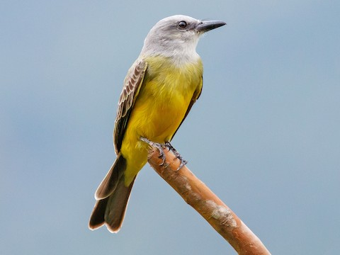

<!--# Un rapport est différent d'un carnet de notes. Il ne s'agit donc pas de faire du copier-coller d'un document vers l'autre. Un rapport de synthèse doit être compréhensible sans devoir lire le carnet de notes. Le rapport de synthèse doit être  rédigé avec un style et une présentation adéquats. -->

## Introduction

L'identification correcte de la sous-espèce d'un individu est devenue une nécessité. Toute volonté de gestion des populations ou de conservation nécessite en effet de cibler correctement les individus étudiés [@zink2004role]. Bien que la zone géographique puisse dans certains cas aider à l'identification de la sous-espèce, ce n'est pas le cas chez *Tyrannus melancholicus*, pour qui les différentes sous-espèces vivent en sympatrie. Par ailleurs, l'utilisation de données uniquement morphologiques pour l'identification peut s'avérer utile, notamment pour les spécimens de musée.

## But

<!--% Rédigez le but de ce rapport en 2 phrases.-->

Ce rapport tente de mettre en évidence quelles variables morphométriques permettent de déterminer au mieux l'appartenance à une des sous-espèces de *Tyrannus melancholicus*.

## Matériel et méthodes

<!--% Cette section doit comprendre deux parties. La première partie doit expliciter les données employées et la seconde traiter des analyses réalisées et des logiciels employés.-->

Notre jeu de données reprends des mesures réalisées par @MacPherson2021data. Il contient des données sur le tyran mélancolique *Tyrannus melancholicus* Vieillot, 1819.



Les données reprennent différentes mesures morphométriques portant sur le bec (notamment sa profondeur) , la queue, le tarse ainsi que les ailes via la longueur du cordon alaire, définie comme la longeur entre l'articulation carpienne et l'extrémité de la la plus longue rémige quand l'aile est pliée. Des informations qualitatives comme le stade de vie , le sexe et le pays d'origine sont aussi connues.


Différentes représentations visuelles des données ont été réalisées. Les analyses réalisées consistent en une régression linéaire et un modèle linéaire. Tout cela a été réalisé dans `r R.version.string` et plus précisément en utilisant la [SciViews Box 2025](https://www.sciviews.org/svbox/) dans [Saturn Cloud](https://saturncloud.io).

## Résultats

```{r import data}
SciViews::R("model")
tyrannus <- read("data/melancholicus.rds")
tyrcontinent <- tyrannus %>%
  filter(!is.na(country)) %>%
  mutate(continent = case_when(
    country %in% c("Argentina","Bolivia","Brazil","Colombia","Ecuador",
                   "Paraguay","Peru","Suriname","Uruguay","Venezuela") ~ "Am.du Sud",
    country %in% c("Bahamas","Belize","Cayman Islands","Costa Rica","Cuba",
                   "Dominican Republic","Dominican Republican","El Salvador","El Salvardor",
                   "Guatemala","Guyana","Haiti","Honduras","Jamaica","Mexico",
                   "Nicaragua","Panama","Puerto Rico","Trinidad and Tobago") ~ "Am.Centrale",
    country %in% c("Canada","United States","United States of America") ~ "Am.du Nord"
  )) %>%
  filter(continent != "Am.du Nord") 
```

<!--% Présentez les deux modèles les plus pertinents que vous avez sélectionnés. Structurez la section en deux parties avec deux titres de niveau trois.-->

### Visualisation des données

```{r 1}
chart(tyrannus, ~tarsus|abbr_sp)+
geom_histogram(bins = 30)+
ylab("Effectifs")

give_n3 <- function(x)
  c(y = max(x) * 1.1, label = length(x)) 

chart(tyrannus,tarsus ~abbr_sp )+
geom_boxplot()+ stat_summary(fun.data = give_n3, geom = "text", hjust = 0.5)
```

Les individus des sous-espèces *melancholicus* et *despotes* présentent une longueur de tarse maximale de respectivement 21 mm et 20 mm, tandis que ceux de la sous-espèce *satrapa* atteignent environ 22 mm.

```{r 2}
tyrcontinent %>.%
  sdrop_na(.,abbr_sp,bill_depth)->
  tyr1

give_n4 <- function(x)
  c(y = max(x) * 1.1, label = length(x))

chart(data = tyr1, bill_depth ~ abbr_sp %fill=% continent) +
  geom_boxplot() +
  labs(
    title = "Profondeur du bec selon la sous-espèce et le continent",
    x = "Sous-espèce",
    y = "Profondeur du bec (mm)",
    fill = "Origine"
  )+ stat_summary(fun.data = give_n4, geom = "text", hjust = 0.5, position = position_dodge(width = 0.75))
table(tyrcontinent$abbr_sp, tyrcontinent$continent)

```

On remarque que chez la sous-espèce *melancholicus*, le bec a une profondeur médiane légèrement plus importante en Amérique du Sud qu'en Amérique Centrale. Chez la sous espèces *satrapa*, la profondeur médiane du bec est plus petite chez les individus sud-américains.

### Régression linéaire de la longueur du cordon alaire en fonction de la longueur de queue

```{r 3}
tyrannus_lm<-lm(data=tyrannus,wing_cord~ tail)


summary(tyrannus_lm)|>
  tabularise()


chart(tyrannus_lm)
```

$$
`r eq__(tyrannus_lm, use_coefs = TRUE, coef_digits = c(2, 2, 3, 3, 2, 3), wrap = TRUE, terms_per_line = 2)`
$$ Cette régression montre une relation directe entre la longueur du cordon alaire et la longueur de la queue. Lorsque la queue augmente de 1mm, la longueur du cordon alaire augmente de 0,73mm. Chaque paramètre est significativement différent de 0 au seuil $\alpha$ de 5% (test t , ***XXX à compléter**) et (test t ,* **XXX à compléter**). Les conditions (normalité des résidus, homoscédasticité) ont été analysées et validées. Le R² étant assez modéré, le pouvoir de prédiction du modèle est donc toutefois limité. Cette simple approche ne permet donc pas de déterminer la sous-espèce d'un *Tyrannus melancholicus*. Toutefois, cette régression indique l'existence d'un lien entre ces variables qui mériterait d'être étudié avec des outils plus adéquats ou en complément d'autres variables.

### Modèle linéaire entre la longueur du tarse et la profondeur du bec

```{r 4}
contlm <- lm(data = tyrcontinent, tarsus ~ bill_depth  * abbr_sp)
summary(contlm) |> tabularise()

chart(data = tyrcontinent, tarsus ~ bill_depth %col=% abbr_sp ) + 
  geom_point() +
   stat_smooth(method = "lm", formula = y ~ x) +
  xlab("Profondeur du bec [mm]") +
  ylab("Longueur du tarse [mm]")
```

$$
`r eq__(contlm, use_coefs = TRUE, coef_digits = c(2, 2, 3, 3, 2, 3), wrap = TRUE, terms_per_line = 2)`
$$ Tous les termes du modèle sont significativement différents de 0 au seuil $\alpha$ de 5% (test machin pour chaque param , \***XXX à compléter**). Cela démontre l'existence d'une interaction entre la longueur du tarse et la profondeur du bec et montre que ces variables seraient à priori de bonnes candidates pour de plus profondes recherches sur le sujet..

La distribution des résidus est très proche de la normale et montre une bonne homoscédasticité. La distance de Cook est faiblement impactée par des valeurs influentes. L'analyse des résidus a donc été considérée comme satisfaisante 

## Discussion et Conclusion

Une approche multivariée, intégrant plusieurs traits et facteurs géographiques semble nécessaire pour améliorer la discrimination et comprendre la variabilité intra-spécifique. <!--% En tenant compte du but de votre carnet de notes et de vos résultats, discutez de résultats et proposez des conclusions à votre analyse en 5 à 10 phrases. -->

## Bibliographie
